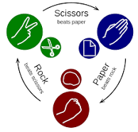
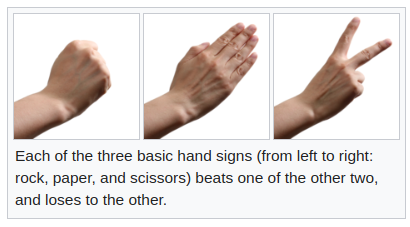

> gane time

# ROCK PAPER SCISSORS IN PYTHON

### **Rock paper scissors** (also known by other orderings of the three items, with "rock" sometimes being called "stone," or as Rochambeau, roshambo, or ro-sham-bo)[1][2][3] is a hand game, usually played between two people, in which each player simultaneously forms one of three shapes with an outstretched hand. 

### These shapes are:
- **"rock"** (a closed fist)
- **"paper"** (a flat hand)
- **"scissors"** (a fist with the index finger and middle finger extended, forming a V). 

> The earliest form of "rock paper scissors"-style game originated in China and was subsequently imported into Japan, where it reached its modern standardized form, before being spread throughout the world in the early 20th century.

### A simultaneous, zero-sum game, it has three possible outcomes:
1. A draw
2. A win
3. A loss. 

> A player who decides to play rock will beat another player who has chosen scissors ("rock crushes scissors" or "breaks scissors" or sometimes "blunts scissors"[4]), but will lose to one who has played paper ("paper covers rock"); a play of paper will lose to a play of scissors ("scissors cuts paper"). If both players choose the same shape, the game is tied and is usually immediately replayed to break the tie.

**Rock paper scissors is often used as a fair choosing method between two people, similar to coin flipping, drawing straws, or throwing dice in order to settle a dispute or make an unbiased group decision. Unlike truly random selection methods, however, rock paper scissors can be played with a degree of skill by recognizing and exploiting non-random behavior in opponents**

## Feel free to modify 

<m.silverbuckson@gmail.com>
@Viestar2023